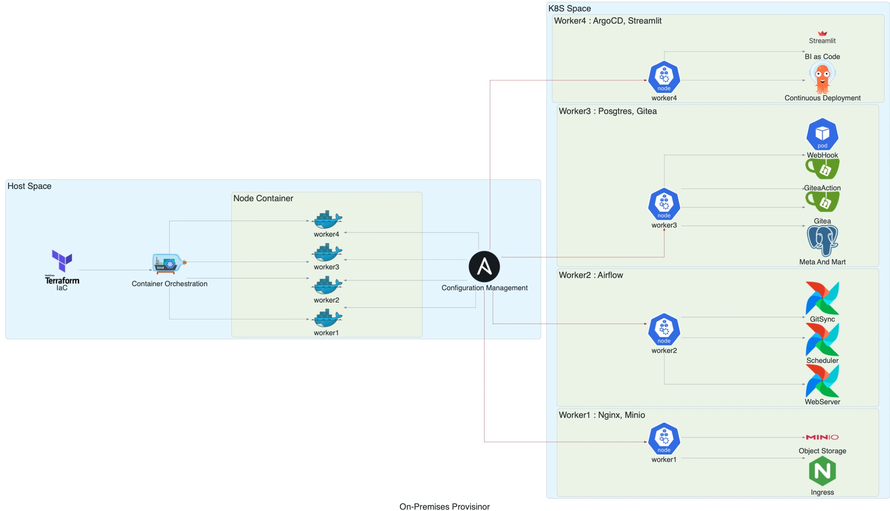
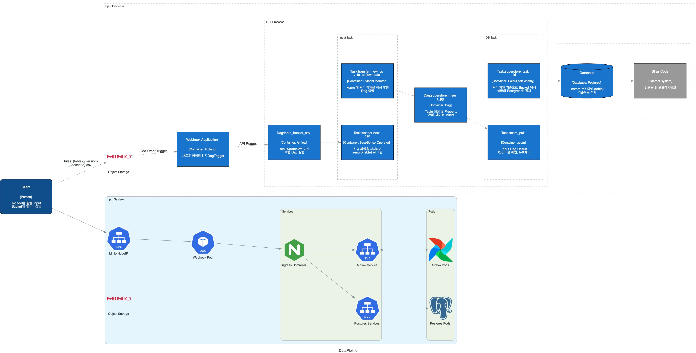

# local-infra

> **로컬 머신 위에서 Kubernetes 기반의 완전한 데이터 플랫폼을 재현하는 On-Premises 인프라 프로비저닝 프로젝트**

Terraform + Ansible로 Kind 클러스터를 자동 구성하고, GitOps(ArgoCD) · 이벤트 드리븐 파이프라인(MinIO → Go Webhook → Airflow) · 에어갭 레지스트리 패턴까지 — 클라우드 없이 로컬에서 프로덕션 수준의 데이터 엔지니어링 환경을 구성합니다.

---

## Architecture





### 레이어별 구성 요소

| Layer | Component | Purpose | Key Responsibilities | Why This Component? |
|---|---|---|---|---|
| **클러스터 레이어** | Kind (Kubernetes in Docker) | 로컬 K8s 클러스터 구성 | 1 control-plane + 4 worker 노드 관리, IPVS kube-proxy | 로컬 환경에서 멀티노드 K8s를 Docker 컨테이너로 구동 가능 |
| **에어갭 레지스트리** | Docker Registry (`registry.local:5000`) | 로컬 이미지 레지스트리 | 외부 이미지 pre-pull 후 내부 배포 | 인터넷 단절 환경에서도 클러스터 재배포 가능. Air-gap 패턴 구현 |
| **IaC 레이어** | Terraform + Ansible | 인프라 코드화 | 클러스터 생성(Terraform), 서비스 배포(Ansible playbook) | Terraform이 `null_resource`로 Ansible 호출 → 선언형 전체 자동화 |
| **Ingress 레이어** | Nginx Ingress Controller v1.9.4 | 외부 트래픽 라우팅 | NodePort 30080, 3-replica, worker1 고정 배치 | K8s 표준 Ingress 구현체, 로컬 도메인(`*.local`) 라우팅 처리 |
| **소스 관리** | Gitea 1.21.11 | 자체 호스팅 Git 서버 | HTTP/SSH, Actions Workflow, PostgreSQL 백엔드 | 인터넷 없는 환경에서 GitHub 역할 완전 대체 |
| **CI/CD 러너** | Gitea Act Runner 0.2.11 | Gitea Actions 실행 | Docker-in-Docker 백엔드로 이미지 빌드 → 레지스트리 push | GitHub Actions 호환 문법으로 로컬 CI/CD 파이프라인 구현 |
| **GitOps** | ArgoCD v2.10.7 | K8s 배포 자동화 | Gitea `helm` 레포 감시 → 자동 sync/prune/self-heal | App of Apps 패턴으로 서비스 추가 시 Helm 차트 push만으로 자동 배포 |
| **오브젝트 스토리지** | MinIO | S3 호환 로컬 스토리지 | ETL 입출력 파일, Airflow 로그 저장 | AWS S3 호환 API로 boto3/mc 그대로 사용, 로컬 클라우드 스토리지 재현 |
| **Webhook 브리지** | Go HTTP Server (port 8081) | 이벤트 드리븐 DAG 트리거 | MinIO 이벤트 수신 → Airflow metadata DB 조회 → REST API 호출 | 파일 태그 기반으로 DAG를 동적 매핑, Polling 방식 대비 즉시 반응 |
| **워크플로우 오케스트레이터** | Apache Airflow 2.5.1 | 배치 파이프라인 관리 | Scheduler + Webserver 분리, git-sync 사이드카로 DAG 자동 동기화 | 코드 변경 즉시 반영(Pod 재시작 불필요), PostgreSQL metadata + MinIO 로그 |
| **데이터베이스** | PostgreSQL 15 | 중앙 RDBMS | airflow / gitea / argocd DB 자동 생성, ETL 결과 적재 | 3개 서비스 백엔드 DB를 단일 인스턴스에 통합, 비용 효율 |
| **데이터 시각화** | Streamlit | 인터랙티브 대시보드 | PostgreSQL `bi` 스키마 조회, 멀티페이지 (Home / Sales / SuperStore) | Python 기반 빠른 프로토타이핑, 데이터 엔지니어가 직접 BI 화면 구성 |
| **BI 리포팅** | Evidence | SQL 기반 리포팅 | 마크다운 + SQL로 정적 리포트 생성 | 코드로 관리되는 BI 리포트, 버전 관리 가능 |
| **환경 설치 도구** | Go CLI Installer | 로컬 의존성 자동화 | Homebrew 패키지 + Docker 이미지 pre-pull | `terraform apply` 이전 사전 환경 세팅 전체 자동화 |

---

## Data Flow

```
[CSV 파일 업로드]
        │
        ▼
[MinIO - input/ 버킷]
        │
        ├── ① MinIO 버킷 이벤트 알림
        │           │
        │           ▼
        │   [Webhook Server (Go, :8081)]
        │           │
        │           ├── Airflow metadata DB (PostgreSQL) 조회
        │           │   (파일 태그 → 활성 DAG ID 매핑)
        │           │
        │           └── ② Airflow REST API로 DAG 트리거
        │
        ▼  ③ input_bucket DAG (10초 폴링 센서)
[MinIO - result/superstore/ 버킷]
        │
        ▼  ④ superstore DAG
   [Polars 읽기 → 컬럼 정규화 → 메타데이터 추가]
        │
        ▼
[PostgreSQL - estore.superstore 테이블]
        │
        ▼
[Streamlit / Evidence - 데이터 시각화 및 리포팅]


── DAG 코드 변경 흐름 ──────────────────────────────────────

[로컬 코드 수정]
        │
        ▼
[Gitea - airflow-dag 레포 push]
        │
        ├── git-sync 사이드카 (주기적 pull)
        │           │
        │           ▼
        │   [Airflow DAG 디렉토리 자동 반영]
        │   (Pod 재시작 없음)
        │
        └── Gitea Actions (Act Runner)
                    │
                    ▼
            [Docker 이미지 빌드 → registry.local push]


── Helm 차트 배포 흐름 ─────────────────────────────────────

[Gitea - helm 레포 push]
        │
        ▼
[ArgoCD - App of Apps 감시]
        │
        ▼
[Kubernetes 자동 sync / prune / self-heal]
```

---

## DAG 구성

| DAG | 트리거 방식 | 역할 |
|-----|-----------|------|
| `input_bucket` | 스케줄 (10초 센서) | MinIO `input/` 버킷 폴링 → 신규 CSV 감지 → `result/superstore/`로 이동 |
| `superstore_sample` | MinIO 이벤트 (Webhook) | S3 → Polars 읽기 → 컬럼 소문자 변환 + 메타데이터 추가 → PostgreSQL 적재 |
| `superstore_renew` | MinIO 이벤트 (Webhook) | `superstore_sample` 리팩터링 버전 (XCom 연동 구조) |

---

## Cluster Node 배치

| 노드 | 주요 서비스 | 리소스 제한 | 포트 |
|------|-----------|-----------|------|
| control-plane | Kubernetes 컨트롤 플레인 | - | - |
| worker1 | MinIO, Nginx Ingress | CPU 2, MEM 2g | 30080, 30081 |
| worker2 | Apache Airflow | CPU 2, MEM 4g | - |
| worker3 | PostgreSQL, Gitea | CPU 2, MEM 2g | 30432, 30022 |
| worker4 | ArgoCD | CPU 2, MEM 4g | 30190 |

---

## Port & Domain 구성

| 포트 | 서비스 | 로컬 도메인 |
|------|--------|-----------|
| 30080 | Nginx Ingress / Gitea HTTP | `gitea.local:30080` |
| 30081 | MinIO API (S3) | `minio.local` |
| 30190 | ArgoCD | `argocd.local` |
| 30432 | PostgreSQL | - |
| 30022 | Gitea SSH | - |
| 8081 | Webhook Server | - |

`/etc/hosts` 에 아래를 추가합니다.

```
127.0.0.1  minio.local
127.0.0.1  airflow.local
127.0.0.1  argocd.local
127.0.0.1  gitea.local
127.0.0.1  evidence.local
127.0.0.1  streamlit.local
```

---

## Tech Stack

| 범주 | 기술 | 버전 |
|------|------|------|
| 컨테이너/클러스터 | Kind | v1alpha4 |
| IaC | Terraform | - |
| 구성 관리 | Ansible, kubernetes.core | - |
| 워크플로우 | Apache Airflow | 2.5.1 |
| 오브젝트 스토리지 | MinIO | 2025-04-08 |
| Git 서버 | Gitea | 1.21.11 |
| CI 러너 | Gitea Act Runner | 0.2.11 |
| GitOps | ArgoCD | v2.10.7 |
| Ingress | Nginx Ingress Controller | v1.9.4 |
| 데이터베이스 | PostgreSQL | 15 |
| Cache | Redis | 7.4.2-alpine |
| Git Sync | git-sync | v3.6.6 |
| Webhook | Go | - |
| 데이터 처리 | Polars | - |
| 시각화 | Streamlit | - |
| BI 리포팅 | Evidence | - |

---

## 프로젝트 구조

```
local-infra/
├── main.tf                     # 인프라 전체 오케스트레이션 진입점
├── requirements.txt            # Ansible + Airflow Python 의존성
│
├── iac/                        # Kind 클러스터 생성 모듈
│   ├── cluster.tf              # 클러스터 생성 + kubeconfig 추출
│   └── kind-config.yaml        # 1 control-plane + 4 worker 정의
│
├── modules/                    # 서비스별 Terraform + Ansible 모듈
│   ├── nginx/                  # Nginx Ingress Controller
│   ├── postgres/               # PostgreSQL StatefulSet + DB 초기화 Job
│   ├── minio/                  # MinIO 오브젝트 스토리지
│   ├── gitea/                  # Gitea + Act Runner
│   ├── argocd/                 # ArgoCD + App of Apps 설정
│   ├── airflow/                # Airflow (Custom Dockerfile + git-sync)
│   └── application/           # Webhook ConfigMap
│
├── vars/                       # Ansible 변수 파일
│   ├── ansible_common.yaml     # 서비스 공통 설정 (포트, 이미지, 크리덴셜)
│   ├── ansible-airflow.yaml    # Airflow DB/S3/Git 연결 설정
│   └── ...
│
├── template/                   # Jinja2 기반 K8s 매니페스트 템플릿
│   ├── template_deployment.yaml.j2
│   ├── template_svc.yaml.j2
│   └── ...
│
├── src/                        # 애플리케이션 소스 코드
│   ├── airflow-dag/            # Airflow DAG 정의
│   ├── webhook/                # Go HTTP 서버 (MinIO 이벤트 브리지)
│   ├── streamlit/              # 데이터 시각화 앱
│   ├── evidence/               # BI 리포팅 툴
│   └── helm/                   # ArgoCD가 참조하는 Helm 차트
│
├── installer/                  # Go 기반 로컬 의존성 설치 CLI
├── sampledata/                 # Superstore CSV 샘플 데이터
└── diagram/                    # 아키텍처 다이어그램
```

---

## Setup

### Prerequisites

> ⚠️ Apple Silicon (ARM64) 환경 기준입니다.

**1. 의존성 자동 설치 (Go CLI)**

```bash
cd installer
go run main.go
```

Homebrew 패키지(`colima`, `kind`, `terraform`, `kubectl`, `mc`, `go`)와 필요한 Docker 이미지를 자동으로 설치/pull합니다.

**2. `/etc/hosts` 도메인 등록**

```bash
sudo tee -a /etc/hosts <<EOF
127.0.0.1  minio.local
127.0.0.1  airflow.local
127.0.0.1  argocd.local
127.0.0.1  gitea.local
127.0.0.1  evidence.local
127.0.0.1  streamlit.local
EOF
```

**3. Colima 실행**

```bash
colima start --cpu 10 --memory 12 --disk 100
```

**4. Python 의존성 설치**

```bash
pip install -r requirements.txt
```

**5. 전체 인프라 프로비저닝**

```bash
terraform init
terraform apply -auto-approve
```

Terraform이 아래 순서로 자동 실행됩니다.

```
Kind 클러스터 생성
    → 노드 리소스 제한 적용
        → 로컬 레지스트리에 이미지 push (Air-gap)
            → Nginx → PostgreSQL → MinIO → Gitea → ArgoCD → Airflow
```

---

## Implementation Details

### Air-gap 로컬 레지스트리 패턴

모든 외부 이미지(`argocd`, `minio`, `gitea`, `airflow` 등)를 `registry.local:5000`에 pre-push합니다. Kind 클러스터 내부는 외부 인터넷 없이 로컬 레지스트리에서만 이미지를 pull합니다. 클러스터를 삭제 후 재생성해도 추가 다운로드 없이 즉시 복원됩니다.

```bash
# 예시: 이미지 로컬 레지스트리 push (Terraform이 자동 수행)
docker tag argoproj/argocd:v2.10.7 registry.local:5000/argocd:v2.10.7
docker push registry.local:5000/argocd:v2.10.7
```

### 이벤트 드리븐 DAG 트리거 (MinIO → Go Webhook → Airflow)

MinIO에 파일이 업로드되면 버킷 이벤트 알림이 Go Webhook 서버(port 8081)로 전달됩니다. Go 서버는 파일의 태그를 파싱한 뒤 Airflow metadata DB(PostgreSQL)를 직접 조회하여 해당 태그와 일치하는 활성 DAG ID를 찾아 Airflow REST API로 트리거합니다.

```
MinIO 업로드 이벤트
    → Go Webhook 수신 (파일 태그 파싱)
        → Airflow PostgreSQL 조회 (태그 ↔ DAG 매핑)
            → Airflow REST API POST /api/v1/dags/{dag_id}/dagRuns
```

Polling 방식 대비 파일 업로드 즉시 DAG가 실행되며, 태그 기반 동적 매핑으로 단일 Webhook 서버가 다수의 DAG를 처리합니다.

### App of Apps (ArgoCD GitOps)

`apps-root` 라는 단일 ArgoCD Application이 Gitea의 `helm` 레포 `argocd/` 경로 전체를 감시합니다. 새로운 서비스를 추가할 때 Helm 차트를 Gitea에 push하면 ArgoCD가 감지하여 자동으로 K8s에 배포합니다. `auto-prune`과 `self-heal`이 활성화되어 있어 Git이 항상 클러스터의 단일 진실의 원천(Single Source of Truth)이 됩니다.

### git-sync 사이드카 (DAG 자동 동기화)

Airflow Scheduler/Worker Pod에 `git-sync v3.6.6` 사이드카 컨테이너가 함께 실행됩니다. Gitea의 `airflow-dag` 레포를 주기적으로 pull하여 `/opt/airflow/dags/repo-main`에 반영합니다. DAG 코드를 수정하고 Gitea에 push하면 Pod 재시작 없이 Airflow가 새 DAG를 자동으로 인식합니다.

### Jinja2 템플릿 기반 매니페스트 생성

`template/` 디렉토리의 공통 Jinja2 템플릿(`template_deployment.yaml.j2`, `template_svc.yaml.j2` 등)에 Ansible 변수를 주입하여 각 서비스의 K8s 매니페스트를 동적 생성합니다. 서비스마다 별도 YAML을 작성할 필요 없이 `vars/ansible_common.yaml`의 변수 값만 변경하면 전체 배포에 반영됩니다.

### Terraform + Ansible 하이브리드

- **Terraform**: Kind 클러스터 생성, kubeconfig 추출, 의존성 체인 관리
- **Ansible**: `kubernetes.core.k8s` 모듈로 각 서비스 K8s 배포
- **연결 방식**: Terraform `null_resource` + `local-exec`로 Ansible 플레이북을 순서에 맞춰 호출

각 모듈은 `depends_on`으로 엄격한 배포 순서를 보장합니다 (PostgreSQL 준비 완료 후 Gitea 배포, Gitea 준비 후 ArgoCD 배포 등).

---

## TODO

- [ ] Kafka 기반 실시간 스트리밍 파이프라인 추가
- [ ] Spark on Kubernetes 연동
- [ ] Prometheus + Grafana 모니터링 스택 구성
- [ ] Vault를 활용한 시크릿 관리 고도화
- [ ] CI/CD 파이프라인 고도화 (Gitea Actions → ArgoCD 자동 배포 연동)
